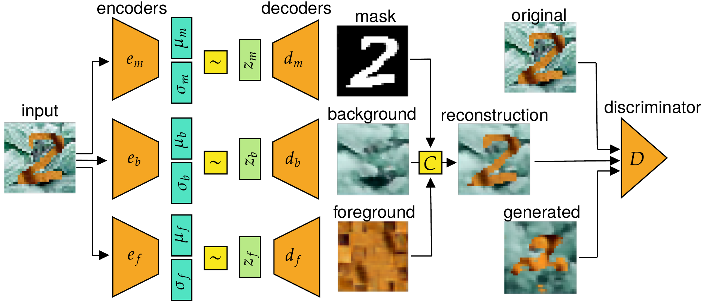

# Shape Guided Anomaly Detection
This project aims to detect anomalies in images on three different levels - shape, foreground and background texture.



# Instalation
Preferably into a specific python environment. Built on Python 3.9.6
```
git clone https://github.com/vitskvara/sgad.git
cd sgad
pip install .
```

# Test run
This is a basic training run of the SGVAEGAN model that demonstrates the capabilities of the model for anomaly detection. It should be relatively easy to understand all the basic functionalities from the code. Note that the script will ask to download the Wildlife MNIST data if they are not present, which can otherwise be found at `https://zenodo.org/record/7602025`. The COCOPlaces dataset that was also used for some experiments can be found at `https://zenodo.org/record/7612053`. 
```
cd scripts/sgvaegan_example
python train_wmnist.py
```
If you get `[SSL: CERTIFICATE_VERIFY_FAILED]` when the package tries to download the vgg16 weights, you can try to download them manually to the indicated directory, e.g. `wget https://download.pytorch.org/models/vgg16-397923af.pth ~/.cache/torch/hub/checkpoints`.

